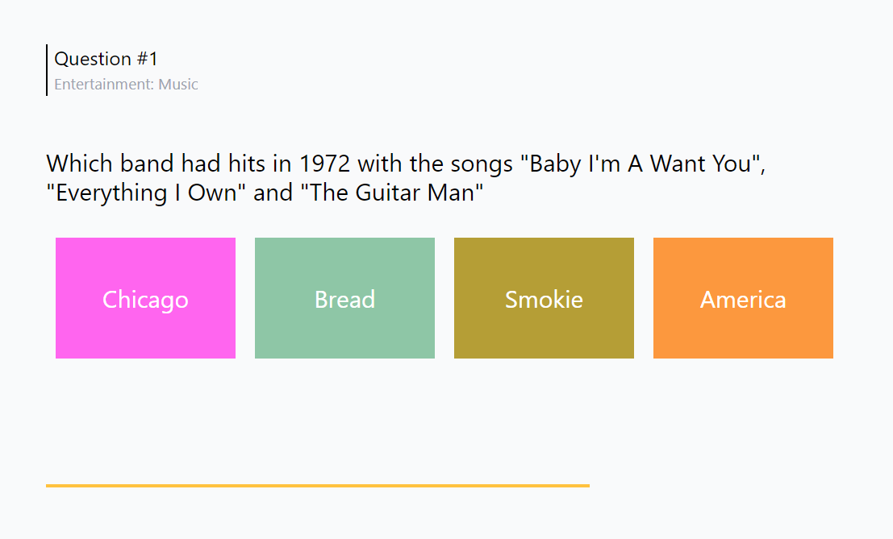

# Trivia Quiz
#### (Vue 3 + Vite + Pinia)

## Introduction

This repository contains a simple trivia quiz app made with Vue 3, Pinia and Vite. The app allows users to take a quiz consisting of multiple choice and true/false questions and provides them with their score upon completion.

## Live Demo
Play now by opening this link:
[https://trivia-quiz-mjkhonline.vercel.app](https://trivia-quiz-mjkhonline.vercel.app)

## How to Install and Use

1. Clone this repository to your local machine using `git clone https://github.com/mjkhonline/Trivia-Quiz`
2. Navigate to the project directory using `cd Trivia-Quiz`
3. Install project dependencies using `npm install`
4. Start the development server using `npm run dev`
5. Open the app in your web browser at `http://localhost:port`

## Source
Questions are gathered from the following source: https://opentdb.com

## License

This project is licensed under the **MIT License**.

